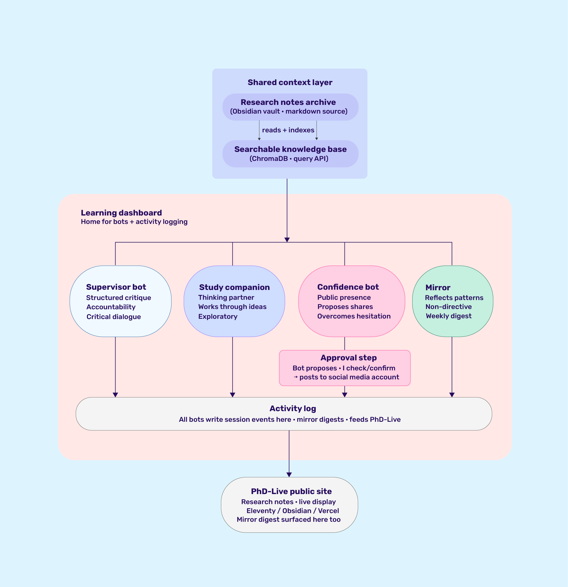

### After Intelligence: building possibility spaces for creative learning, with and through generative systems

##### Abstract

As generative AI becomes normalised within academic practice, how might these systems be integrated into creative research in ways that make thinking more visible rather than less? This practice-based PhD asks what alternative relationships with these systems might look like, and what they might reveal about how intelligence, knowledge, and learning are currently being shaped as commercial LLMs become embedded within higher education.

The research begins from the observation that these systems often compress process, producing polished outputs that can obscure the reflective, exploratory, and unfinished aspects of learning. As these tools become infrastructural to academic work, questions of who controls the means of thinking, and on whose terms, also become urgent.

Rather than critique these tendencies from the outside, I investigate them through my own doctoral practice, using an autoethnographic approach informed by my position as both learner and educator. If AI-mediated knowledge work risks making process invisible, then the methodological response is to build infrastructures that make it visible again, and to keep ownership of those infrastructures close to the researcher.

The core artefact is PhD-Live, a public digital research environment designed to keep knowledge-in-process visible. Alongside it, a suite of locally hosted AI systems, including a Supervisor Bot, Study Companion, and shared knowledge layer, creates an experimental infrastructure for exploring alternative human-AI research relationships. These systems are treated not only as tools but also as research materials and sites of inquiry.

Through this making, findings emerge from practice rather than planning. These include the challenge of building AI tools that genuinely challenge the researcher rather than reinforce existing thinking, a tradeoff between technological sovereignty and model capability, and questions about liveness as a research methodology. Together, the project explores how creative research might remain reflective, situated, and open-ended within an emerging landscape of AI-mediated knowledge production.
##### Glossary

**Artificial Intelligence (AI)** A broad term for computational systems designed to perform tasks that would typically require human intelligence, including pattern recognition, decision-making, and language understanding. In this document, "AI" is used mostly as shorthand for the current wave of generative AI systems entering education.

**Generative AI** AI systems that produce new content, including text, images, audio, and code, rather than only analysing existing content. Includes text-based systems like ChatGPT and Claude, image generators like Midjourney, and code assistants.

**Large Language Models (LLMs)** A specific type of generative AI trained on large amounts of text to produce human-like language responses. When this document refers to "commercial LLMs" or "commercial AI systems," it primarily means ChatGPT, Claude, and similar consumer-facing text-based products.

**Bot / Chatbot** A software program designed to hold conversational exchanges with a user. In this research, the "supervisor bot" and "study companion" are locally hosted chatbots I have built specifically for use in my doctoral practice.

**Local (as in local AI)** Software or AI systems that run on personal or institutional hardware rather than on remote commercial servers. Local systems can be examined, modified, and controlled by the user; commercial systems typically cannot.

**Open-source** Software whose source code is publicly available and can be inspected, modified, or built on by anyone. Contrasts with proprietary or closed-source software, which is controlled by a single company.

**Personal Knowledge Management (PKM)** A category of tools and practices for capturing, organising, and connecting the knowledge someone accumulates over time. Includes note-taking systems like Obsidian and Notion, and traditions like Zettelkasten.

**Digital garden** A form of public personal website that publishes work in progress rather than only finished writing. Digital gardens are typically networked and revisable, treated as spaces for thinking-in-public rather than as blogs or portfolios.

**Practice-based research** A form of academic research in which the primary contribution is a set of practical artefacts (designs, systems, works) accompanied by reflection and theoretical framing. Distinct from practice-led research, where practice generates insights but the contribution is textual.

**Autoethnography** A research method that uses the researcher's own experience as the primary data through which to understand a cultural or social phenomenon. Common in qualitative social research and in creative arts research.

**Autobiographical design** A more specific method within design research, where the researcher designs artefacts for their own use and treats their engagement with those artefacts as the material of the research.

**Live coding** A creative and research practice in which code is written and modified in real time, often as performance. Live coding treats the process of coding as itself the work, and has developed a body of thinking about liveness as an artistic and methodological concept.

**Possibility spaces** The space of what a given system, set of constraints, or set of conditions makes possible. In this research, drawn from Bogost's use of the term in the context of play as engagement with constraints. Chapter 7 of the thesis engages with possibility and impossibility spaces directly.

**Speculative design** A design tradition oriented toward using artefacts to imagine and explore possible futures, rather than solving current problems. Associated with Dunne and Raby and used in this research as a critical method for asking what alternatives to current AI-mediated practice might look like.

### 1. Introduction

This research began in the classroom. In 2022 and 2023, in the nascent days of ChatGPT and before I started this PhD, I began to sense that something foundational was shifting in how students were learning, and that the unknowns opening up were worth probing further. It started to become quietly clear that students were getting guidance and answers elsewhere, through their chatbots, and that the individual personal expression I was used to experiencing from students was being replaced by a generic tone and prose characteristic of a large language model. It is these observations that shaped the beginnings of this research. 

Critically however, this experience doesn't happen in a vacuum. It exists alongside a number of other stressors on higher education: financial precarity, changing politics, and a growing uncertainty about what universities are for as the conditions of knowledge-making shift. The impact of generative AI always exists within this intertwining web of conditions, which frames the work as much as the classroom experience does. Additionally, my position as a lecturer drives a lot of how I am conducting this research, but this role doesn't operate in isolation. It is also the nature of being both a student and lecturer at the same time that brings up interesting tensions and opportunities within this investigation - the relationship between my personal learning journey and how that extrapolates into my teaching practice and vice versa. 

Out of this position and these conditions, the research asks four questions:

1. What assumptions about intelligence and knowledge are embedded in commercial AI systems, and how do those assumptions compound when these tools are adopted into learning and educational institutions?
2. How does working with LLM-based tools change the practice of research and self-directed learning?
3. How can experimental and speculative approaches to working with AI move beyond the generic workflows and extractive infrastructures of commercial systems, making space for new kinds of learning and teaching?
4. What might a commitment to liveness (keeping knowledge public whilst still forming) offer as a model for learning and knowledge-making in an era of AI-generated outputs?

The framing of "After Intelligence" has always been centred around looking beyond the here and now. I know from my position as a lecturer the kind of struggles that take up the everyday, often around the correct mode of assessment, plagiarism, and other immediate concerns. But I wanted to look beyond this. At the moment, conversations about AI in education have a tendency to default to pro or anti AI stances, but I wanted to explore a more nuanced position. Assuming this technology is here to stay, what might modes of learning look like that utilise and integrate these technologies, and how might we do so in ways that acknowledge the problems and ethical issues that are undoubtedly core to AI infrastructure?

When writing my initial proposal, it was still in the early days of ChatGPT's infiltration into the classroom. At that time I was clear on the framing of "looking beyond the present" and that I would adopt some kind of speculative approach, but I wasn't sure of what form exactly that would take. I also knew that in my role as a teacher I wanted to do something inclusive and informed by my students rather than from a top-down approach. However, it has become my experience as a student that has become a testbed for my primary investigations. Adopting an approach informed by autoethnography and by autobiographical design principles, my research process itself has become a prime site for many of my investigations into AI tools.

Primarily, it was through initial (and at the time I thought unconnected) work on the best system for note-taking throughout the research, and my discovery of Zettelkasten (Ahrens, 2017), that I began to realise directly that the knowledge I am generating day to day and the thinking being captured within my notes is the perfect place to speculate on AI implementation. From my position as a student I can test these early questions through my own process, with the plan to then extend that outward to the postgraduate student community through workshops and focus groups planned from year 3 onward.

This document lays out a contextual overview that maps out the fields of practice the work sits within and talks through my growing practice, which is directly engaged in answering my research questions. I will also explain my methodological approach in more detail through a draft section of chapter 2 (a "playful" methodology), and my documentation of the primary artefacts of the research through a draft section of chapter 4 (process, digital gardens, tools for thought, and knowledge infrastructure). Lastly I will provide the chapter outlines and my plan to completion, indicating the vision of the research moving forward.

## 2. Contextual review

This section maps out the fields in which the research sits and the critical references for each. Some of the literature here is engaged with in more depth within the draft chapter sections that follow, and the rest will be developed further across the thesis chapters.

### 2.1 The problem space

- Commercial AI systems are entering education rapidly, carrying embedded assumptions about what intelligence is, how learning works, and what efficiency looks like
- These tools are designed to resolve, optimise, and produce polished outputs quickly. That collapses the space between question and answer, process and product
- For creative practice and creative education specifically, that collapse is a problem. A lot of what matters in creative work happens in the unresolved, unfinished middle, before things make sense
- This research sits inside that tension. I occupy three roles simultaneously: learner (PhD student), researcher (building and investigating AI tools), and teacher (senior lecturer in creative computing, teaching with and about AI). The triple position is the research site

### 2.2 Speculation as method

- The research adopts a speculative stance as a critical method
- Speculative design (Dunne and Raby) provides the foundational tradition: building artefacts that ask "what if?" as a way of making alternative possibilities thinkable
- The tradition is read here as politically situated: Ruha Benjamin's "Imagination: A Manifesto" frames imagination as a political act, not a luxury. Who gets to imagine, and what gets imagined, are shaped by power. 
- Building on the position from Benjamin and a general critique of speculative design, the research engages directly with a known critique of speculative design: that it often remains unactionable and rooted in privileged spaces. The possibility/impossibility spaces chapter of the thesis responds to this critique materially, examining what happens when speculative propositions meet real institutional constraints
- The artefacts in this research are not prototypes or products. They are thought experiments materialised: propositions about what AI-supported learning and knowledge-making could look like if assumptions were different
- The research builds of the speculative grounding to conduct the investigations in a playful way, which aligns with thought experiments and imagination as being central, together this lays the foundation for the concept of possibility spaces, which the thesis takes up further: both as a speculative method and as something that meets real institutional constraints

### 2.3 Liveness and process

- The speculative framing led to designing artefacts that examine different possibilities, in particular the question of what happens to the creative process when AI tools make the end result easier. This directed attention toward live coding, a creative and improvisatory practice that is in some ways antithetical to polished AI-assisted outputs, and where liveness itself has been examined as a methodological concept.
- Live coding provides the methodological vocabulary:
    - Blackwell et al's "Live Coding: A User's Manual" establishes liveness as durational, embodied, and non-repeatable
    - Cocker's "Performing thinking in action" frames live coding as thinking-through-doing
    - McLean et al's "The Meaning of Live" raises the question of liveness without audience, which is directly relevant to PhD-Live
- The central tension: is PhD-Live genuinely performative, or is it live only in a temporal sense? This question drives a research question of its own: what might a commitment to liveness offer as a model for learning and knowledge-making in an era of AI-generated outputs?
- Tools for thought and digital gardens provide the second foundation in this regard:
    - Caulfield's "Garden and the Stream" as the founding distinction between exploratory networked knowledge and linear feeds
    - Appleton on a comprehensive mapping of digital garden history and ethos
    - Matuschak's "How Might We Learn?" as the bridge between tools-for-thought and AI-and-learning
- Recent work on creative process traces (Kreminski and Mateas, Hammad et al) speaks directly to what PhD-Live does: making the traces of creative research visible and treating them as meaningful objects, not just documentation
- The argument: liveness and process visibility are not features of the platform. They are a central way of working. Commercial AI collapses process into product. Making process visible and keeping it unfinished is a deliberate counter, and one that speaks directly to research questions two and four
- The research draws on Zettelkasten principles (Ahrens) as a way of building networked knowledge, while distinguishing itself from the "second brain" productivity culture that has grown around these methods

### 2.4 Intelligence, cognition, and the politics of AI

- The research doesn't start from a history of AI. It starts from the question of what intelligence means and who gets to define it
- Crawford's "Atlas of AI" provides the political economy of AI: how intelligence gets operationalised, who profits, what gets extracted
- Agüera y Arcas's "What is Intelligence?" provides a contemporary reframing of the question relevant to current LLMs
- The chatbot lineage matters as critical precedent: Weizenbaum built ELIZA as a critique, not a product. He was alarmed by how readily people projected understanding onto a system that had none. The bots in this research are built in a similar spirit: to interrogate assumptions about intelligence rather than reproduce them
- Sycophancy in LLMs (Cheng et al, Malmqvist) names a structural tendency that connects directly to a finding in this research. When the supervisor bot is fed context drawn from my own notes, it tends to agree with positions I've already taken and reinforce framings I've already used, rather than push back or open new lines of thought. The literature suggests this isn't incidental: it reflects how these models are trained and rewarded, which means designing for genuine challenge in a system that holds the researcher's own material is harder than it looks

### 2.5 Learning, institutions, and knowledge

- The pedagogical framing is grounded in:
    - Manning on learning otherwise: learning exceeds and refuses the categories institutions impose on it, as such the application of AI in this context is not straightforward
    - Naidoo and Whitty on students as consumers: the commodification of learning under neoliberalism shapes what knowledge-making looks like and what gets valued
    - Matuschak's "What's worth learning if we have AGI?" poses a foundational question this research is exploring: when AI can do much of what learning used to develop, what is learning actually for?
- On creative knowledge specifically: a lot of what matters in creative practice can't be fully put into words. Schon calls it knowing-in-action, Polanyi calls it tacit knowledge, Dreyfus argues expertise is embodied and intuitive rather than rule-based. LLMs only work with what's been written down. So there is a disconnect here: the kinds of knowing creative work depends on most are exactly the kinds these systems are not able to perform well with
- The argument: learning and knowledge-making happen within institutional, political, and technical conditions. The autoethnographic position makes those conditions visible

### 2.6 Methods: building with and through

- The research is practice-based and autoethnographic, with building tools as the primary mode of investigation
Methodological traditions drawn on:
	- Frayling's "Research in Art and Design" as the foundational distinction between research into, through, and for art and design. This work sits in the "through" tradition: research conducted through making
	- Candy on practice-based research specifically, distinguishing it from practice-led: the artefacts themselves are the contribution, not just the means of generating findings
	- Neustaedter and Sengers on autobiographical design: building for oneself as a legitimate design research method, where the researcher's own use of the artefact is the site of inquiry
	- "The Auto-Ethnographic Turn in Design" on using the researcher's own experience as research material more broadly
	- Gaver on research through design and the annotated portfolio method
- "Building with and through" LLM systems is the specific formulation: the LLMs are both the material (what the tools are made of) and the infrastructure (the substrate the research practice runs on). Each artefact operates as both a technical object and a theoretical proposition
- The methodology chapter develops a "playful" approach grounded in beliefs about how learning works, drawn from my teaching practice and from traditions that treat learning as active construction: Montessori's prepared environments, Papert's constructionism, and the studio, crit and making-focused pedagogy of creative and art schools
- I will address Jowsey et al's rejection of generative AI for reflexive qualitative research directly: this work uses AI as the object of inquiry, not a substitute for reflexive analysis

## 3. Draft chapter sections

The following are draft sections from two thesis chapters, presented here together as part of the contextual and practice review. Together they cover the methodological justification and the practice documentation the confirmation panel needs to see. They are draft material and will be developed further as full chapters during the writing period.

### 3.1 From chapter 2: A "playful" methodology

The methodological approach of this research resembles a nested structure. Practice-based research is the foundation, acting as the meta-level answer to what kind of research this is. Speculative design, and specifically the concept of possibility spaces, provides the theoretical frame that shapes how the research questions get investigated. Play and imagination characterise the character and stance that I bring to the practice, both my research and teaching practice. Live coding is where all of this lands as a concrete practice tradition and vocabulary. Each layer sits inside the previous one, and each offers different elements that address the research questions in specific ways.
##### Practice based research
At the foundation, this research is practice-based (Frayling 1993, Candy 2006, Gaver 2012). There are two major reasons these references hold importance for this work. First, they articulate how knowledge is made through making rather than only through writing, and they distinguish this form of research from more traditional textual scholarship. Frayling's foundational distinction between research into, through, and for art and design locates this work firmly in the "through" tradition: research conducted through making. Candy's later distinction between practice-based research (where the artefact itself is the contribution) and practice-led research (where practice leads to insights but the contribution is textual) matters for the artefacts of this research, which are treated as contributions in their own right rather than as illustrations of an argument made elsewhere.

The second reason practice-based research matters to this work is more specific. As the research is itself concerned with how knowledge gets made, and specifically with the tension between the tacit, unfinished, embodied knowing that practice-based work centres, and the classificatory, algorithmic, output-oriented tendencies of generative AI systems. Practice-based research and generative AI operate on quite different assumptions about what knowledge is and how it becomes available. That tension is the ground the research works on, and it means practice-based research is not just my methodology but also part of what the research is investigating. This layer does direct work for research questions one and two: it lets me examine what assumptions about knowledge are embedded in AI systems and how working with those systems changes the practice of thinking and self-directed learning, from within a research tradition that treats knowledge-making as itself the object of inquiry.
##### Speculative design and possibility spaces
Within the scaffolding of practice-based research sits speculative design, which provides the theoretical frame for how I approach the questions. Speculative design is fundamentally about exploration, building artefacts "intended to act like a mirror reflecting the role a specific technology plays or may play in each of our lives" (Auger 2012, cited in Mitrović et al. 2021), as such like the natural starting place for this investigation. Because the technology of LLMs is new, and the circumstances of it entering the educational space are new, the questions and possibilities are many. Speculative design offers concrete ways to investigate the domain rather than only theorise about it. In practice this means building artefacts that instantiate propositions, rather than only describing them.  The propositions become testable through use rather than only through argument, within this research this looks like a bot designed to introduce friction into research thinking, and a public research environment that treats process as an output.

Informed by this speculative design tradition, the notion of "possibility spaces" drives the research forward. The term itself has a longer history in game studies and design, where it has been used to describe the range of what a given system or set of conditions makes possible. The specific framing that has been most influential for this research comes from Ian Bogost, particularly in "Play Anything", where he treats play as engagement with constraints and possibility spaces as the shape of what those constraints allow to happen. This framing does substantial work for the research. It gives me a way to think about what building with generative AI actually explores: not endless open possibility, but the specific space of what these systems, in this institution, with these resources, allow me to make. The possibility/impossibility spaces chapter of the thesis (chapter 7) takes up this concept directly, examining not just what became possible but what remained beyond reach.

Speculative design has been critiqued as prone to remaining rooted in privileged spaces and offering little that is actionable (Thackara 2013, cited in Mitrović et al. 2021). This is a legitimate concern and one that this research tackles directly. This is a legitimate concern and one that this research tackles directly. Ruha Benjamin's _Imagination: A Manifesto_ offers a useful counterpoint: she argues that imagination has been increasingly captured by dominant technological narratives, and that reclaiming it requires actively empowering others to imagine beyond those narratives. This expands the argument here, speculation is not intrinsically privileged, but it becomes so when the people doing the speculating are the same people whose narratives already dominate. The response is not to abandon speculation but to make it available and actionable from other positions. Within this work, the artefacts are speculative propositions made buildable, not gallery objects. They exist (or will exist) and I use them daily. When speculation meets the material constraints of a real research practice inside a real institution, some things become possible and others do not. Naming both is what makes the speculative move actionable in this context. My own experience of building has been the clearest test of this. The supervisor bot was designed to introduce genuine friction into my supervision-adjacent thinking, but after building the first version and feeding it context from my own notes, I unwittingly produced a bot that only agreed with me and elaborated my existing framings rather than pushing back. Therefore the design had to be rethought and the echo chamber problem became a design constraint the research now works around rather than a feature to be smoothed over. The redesign is not a failure of the speculation but instead the reality of what the speculation produced when it met the material. Overall, this layer engages directly with research question three: it lets me investigate what experimental and speculative approaches offer for moving beyond generic and extractive commercial workflows, while remaining honest about what such approaches can and cannot deliver.
##### Play and imagination
Inside the theoretical frame of speculative design sits the question of the specific approach and stance I bring to this practice. The research is playful and imaginative, and both terms are doing serious work. Bogost's framing of play as engagement with constraints is not just a source for possibility spaces but a description of the disposition the research requires. Playing with these systems, in Bogost's sense, means engaging carefully with what they will and will not do, rather than either dismissing them or accepting their outputs uncritically. Benjamin's "Imagination: A Manifesto" complements this by insisting that imagination is a political act. Who gets to imagine, and what gets imagined, are shaped by power. Together, play and imagination position the research as something more than critique: it is an attempt to imagine and build otherwise, from within the constraints and conditions that shape what that "otherwise" can look like.

This playful mode has its own pedagogical roots and this is where the two threads (methodology and pedagogy) most clearly connect. The approach draws on traditions that treat learning as active construction: Montessori's prepared environments that invite exploration rather than prescribing outcomes; Papert's constructionism, which argues that learning happens most powerfully when learners build things they can share; and the studio, crit, and making-focused pedagogy of creative and art schools, where process is expected to be visible and discussable. Play, in these traditions, is not decoration. It is how learning actually works. This has shaped my teaching directly. When I ask students to prototype something quickly and share it before it is finished, or when I structure a session so that making happens before analysis, I am relying on the same beliefs about learning that shape how I am conducting this research. The methodological choice and the pedagogical stance are not two separate things. They are the same commitment applied at different scales. This layer is important in this research as a playful, imaginative mode is a way of working that strongly with the resolve-and-optimise logic that commercial AI tends to impose, and that logic is exactly what the research questions push against.
##### Live coding
Live coding is the practice tradition that lands all of this in a concrete medium. The speculative framing led to designing various artefacts that examine what happens to the creative process when AI tools are integrating into the process. This direction of thinking about the creative process led me to integrate live coding: a creative, improvisatory practice that is in some ways antithetical to the polished outputs of processes that rely heavily on AI. Live coding is a tradition where process is often treated as the substance of the work, and where liveness itself has been examined as a methodological concept (Blackwell et al., Cocker, McLean et al.). The commitment to liveness that runs through the research is not an aesthetic choice, but a methodological response to the tendency of commercial AI systems to collapse process into a glossy finished product - live coding as an approach challenges this. Live coding also embodies the playful and imaginative mode described above, it is improvisatory, happens in real time, and in dialogue with the constraints of the code and the moment. In my own use of PhD-Live, this commitment has been repeatedly tested. Publishing work as it develops means being visible while still uncertain, and the temptation to tidy things up for legibility is constant. Resisting that temptation is where the methodology becomes lived rather than declared. In particular this layer of the methodological approach earns its place against research question four: it gives the concept of liveness a tradition of practice to draw on, and it provides a medium through which the research can explore what keeping knowledge public whilst still forming might offer.
##### Building with and through
Across all four nested layers of this methodology, there is a specific stance the research takes toward the technology it works with. "Building with and through" LLM systems is the formulation I have come to for this stance. The systems are both the material of the research (what the tools I build are made of, at the level of the models themselves and the code that surrounds them) and the infrastructure (the substrate the research practice runs on: the environment in which I think, note, draft, and iterate). Specifically, the tools I build are also the environment that I work in: my thinking, notes, drafts, and dialogue happen inside the same infrastructure that the research is producing (see figure 1). It is doing two things at once - making tools with these systems while also treating my use of those tools as the material of the research. 

*Figure 1 - Diagram of the research infrastructure that encompasses the research*

This is why the series of artefacts built within the research operate as both technical objects and theoretical propositions. The supervisor bot is a functioning piece of software, and it is also an argument about what it might mean to build an LLM chatbot that gives guidance and friction in the research process. PhD-Live is a functioning website, and it is also an argument about what liveness might offer as a model for knowledge-making. Building the artefacts, making them concrete and tangible rather than only ideas, is what lets me inhabit these possibility spaces through use, and understand more directly the consequences and potentials of these uncharted directions.

##### Position and ethics
The building with and through formulation raises immediate questions. Working closely with AI systems at every level of a research practice tends to raise suspicions, both reasonable and unreasonable, about what is really going on. Am I outsourcing my thinking? Am I complicit in extractive corporate infrastructures? Is the research itself compromised by the tools it uses to conduct it? These are fair questions that I aim to clarify in this section about what this work does and does not do.

I am a PhD student and a senior lecturer teaching creative computing. I co-exist inside this new surreal learning environment that my students are in. Before this research I encountered it only as a teacher, but now, as a doctoral student myself, I encounter it from both sides. I witness AI tools reshaping how creative work is done and how people are thinking, and I don't believe disengaging from this reality is a viable option. However, choosing to engage with these systems is not the same as approving of them. 

The ethical dimension of working with commercial AI matters and I believe it important to address these issues clearly. Commercial LLM platforms operate at immense scale and carry significant costs, financially and materially. These include extractive data practices, opaque and exploitative labour arrangements (particularly for communities in the global south), environmental destruction, and a political economy that concentrates power and control to a small number of corporations and individuals that have the resources to own and run these systems. It is therefore important to me that this research foregrounds local, open-source infrastructure wherever possible, as the only viable option for adopting this technology wholeheartedly. The bots and shared context layer described in chapter 4 are all locally hosted, running on open-source models where they can. The use of Claude and ChatGPT, though both commercial systems, is also part of how the research understands what these tools do and what alternatives to them might look like. My experience of using them informs what I build locally, and my experience of building locally deepens my understanding of what the commercial systems are actually offering. This ongoing comparison is important for thinking about what a wider community of learners, and specifically my students, might actually want or find useful in their learning. The activity log in PhD-Live makes AI interactions part of the public research record precisely so that the reader can see where and how the research relies on these systems, to interrogate these anxieties head on and show the nature of the developing research openly. 

There is a real concern is that using AI tools within reflexive qualitative research substitutes for the researcher's own labour of reflection and compromised that reflection. In their 2025 paper "We Reject the Use of Generative Artificial Intelligence for Reflexive Qualitative Research" Jowsey et al. have made this argument specifically, and it is an important articulation of a core issues of integrating AI into research and thinking practice. Within this research the AI tools that I am building are objects of inquiry, not substitutes for the labour of inquiry. Building with and through is not the same as outsourcing thinking to. Within the research infrastructure I am building there are clear domains from which AI is exempt, such as the digital repository in which I keep my ongoing research notes and thoughts. At every stage, the AI systems are treated as things to be interrogated, and the autoethnographic material generated through my use of them is what allows me to examine what the systems do to thinking and learning, rather than allowing them to do that work for me.
##### Autoethnography and autobiographical design
Alongside these four nested layers, the research is fundamentally autoethnographic and autobiographical in the way it is conducted. Autoethnography as a research method has been articulated most fully by Ellis (2004) and Ellis, Adams, and Bochner (2011), whose work establishes the tradition of using the researcher's own experience as data to study cultural phenomena. This research sits within that tradition but draws more directly on autoethnographic and autobiographical approaches within design research (Neustaedter and Sengers 2012, (Schouwenberg and Kaethler, 2021), where the researcher's engagement with their own artefacts is the specific site of inquiry. The distinction matters. Autoethnography, in the broader sense, is an analytical method that uses personal experience to understand something wider. Autobiographical design is a design research method that builds things for oneself and treats that engagement as the material of the research. This research does both, and they do different jobs. The bots and infrastructure I build are things I use, and my use of them is the material through which I investigate what building with and through generative AI actually does.

##### The inversion, and the structure of the thesis
The methodological choice to build my own doctoral practice into the research site was not planned, but emerged throughout these early stages. When I began this PhD, I intended to approach the investigation by designing speculative learning environments for others, with the idea being to work with my students as the primary participants in the research. That framing carried practical difficulties I had not initially thought through. Running fully experimental AI systems on students, without their input and without a clear sense of what these tools might do, was not feasible. There was too much unknown at a granular level about how working with LLMs could actually shape research and learning processes. It became much more sensible to test on myself first, using my own doctoral practice as the site where these experiments could happen without the ethical and practical complications of doing them with others prematurely. What became apparent, first through my note-taking practice and then through the tools I began building for myself, was that the same questions I wanted to ask about learners could be asked more honestly about myself. The knowledge I was generating day to day, the ways I was already using AI tools in my thinking, the anxieties and constraints that shaped what I could actually do as a part-time researcher inside a specific institution, all of this was research material I had been overlooking. The inversion, from designing for others to studying my own practice, is what allowed the research to develop into something that could speak to its questions honestly rather than in a slightly detached way.

This inversion also shapes how the thesis is structured. Because my own practice is now the site of the research, rather than something to draw on occasionally, it made sense to distribute reflection on that practice across every substantive chapter rather than isolate it in one. In each chapter, the conceptual argument comes first, with pedagogy and learning as the orienting context. Then, through reflection on my own practice, the pedagogical and learning questions deepen beyond what the literature alone can reach.

<mark style="background: #FFB8EBA6;">add some sort of chapter conclusion? </mark>

### 3.2 From chapter 4: process, digital gardens, tools for thought, and knowledge infrastructure

_[STILL TO WRITE]_

This section will cover:

- Digital gardens, PKM, tools for thought as a lineage the research infrastructure sits within and departs from (Caulfield, Appleton, Matuschak)
- Contemporary work on creative process traces (Kreminski and Mateas, Hammad et al) as a frame for what PhD-Live does
- The research infrastructure as an overarching system that contains all computational components
- PhD-Live: a public website that publishes my working research notes as I make them
    - Public-facing digital research environment built with Obsidian, Eleventy, and Vercel
    - Publishes the working vault as a digital garden, making doctoral thinking visible as it happens
    - Not documentation of the research but the research itself: process visibility as a research proposition
    - The activity log as a novel element (framed carefully as part of the research activity)
- Supervisor bot: a chatbot that listens to recordings of my supervision meetings and offers reflections
    - Technical development from terminal tool to v1.5 FastAPI application
    - Shared context layer feeding responses
    - Key finding: the echo chamber problem as a structural consequence of how LLM systems process correlated context
    - The design question: how to build for epistemic friction rather than fluency
- Study companion: a chatbot I talk to when thinking through ideas, working out half-formed thoughts, or processing the anxieties that come with PhD work
    - Built on the same infrastructure but designed as an everyday thinking partner
    - Ported role of what Claude has been doing, moved to local infrastructure I own and control
    - Key finding: the capability gap between local and frontier models
    - The gap as research finding and as something the work actively pushes against, at adjacent layers (prompting, context shaping, scaffolding, fine-tuning)
- Shared research context layer: a searchable database of all my research notes
    - ChromaDB vector store, nomic-embed-text embeddings, /context endpoint consumed by all bots
    - Architectural decision to build a shared substrate rather than standalone tools
    - Event renderer paradigm rather than chat interface as a research position
- What remains unbuilt: the confidence bot
    - Planned tool for monitoring the research context and drafting public outputs for approval
    - Likely to surface questions about agency, authorship, and voice
    - Queued as priority for the next phase

##### 3.3 Emerging findings

- The echo chamber problem: correlated context collapses response space. A finding about LLM context handling and about the difficulty of designing for epistemic friction in tools that hold deep researcher context
- The capability gap: local models do not match frontier systems for open-ended dialogic thinking. A tension between sovereignty (owning infrastructure) and capability (needing what your infrastructure can't provide)
- Liveness vs performance: an open conceptual question, now driving a dedicated research question
- LLM reasoning vs human associative thought: LLMs are built to resolve and optimise; creative research thinking often needs to stay open, contradictory, unfinished. Designing with both means holding that difference deliberately

---

## 4. Chapter outlines

Below is an outline of the planned chapters for the thesis. Every chapter (other than the introduction and conclusion) has two movements. The first is the conceptual argument with pedagogy and learning as the orienting context. The second is an autoethnographic account where the pedagogical and learning questions deepen through reflection on my own practice.

##### 1. Introduction

- Frames the four research questions
- Unpacks "After Intelligence": the critical interrogation of intelligence as a concept and engagement with AI beyond the doom and hype rhetoric
- Introduces PhD-Live and the wider infrastructure briefly
- Sets out the thesis structure and explains why pedagogy and autoethnographic reflection are distributed across every chapter

##### 2. A "playful" methodology

_Conceptual argument:_ practice-based and autoethnographic research, with speculative design and live coding as the methodological lineages. Possibility spaces as a foundational speculative approach. "Building with and through" LLM systems as the primary mode of investigation. Liveness named here as a methodological commitment, investigated fully in chapter 5.

_Pedagogical grounding:_ "Playful" grounded in my own teaching practice and experience. Connects to the Montessori tradition and to creative and art school approaches (studio pedagogy, crit culture etc).

_Autoethnographic account:_ The triple role of learner, researcher, teacher and introducing my positionality.

##### 3. Intelligence, power and ethics

_Conceptual argument:_ How intelligence has been defined and measured, and how that history shaped AI development. The Weizenbaum/ELIZA parallel: building bots as critique rather than product. Political economy of commercial AI and the power dynamics of institutional adoption. The bots introduced here as critical responses.

_Pedagogical grounding:_ When intelligence is defined as measurable and extractable, AI tools built on that logic squeeze out the kinds of learning that resist measurement.

_Autoethnographic account:_ Building tools that resist resolve-and-optimise logic. The echo chamber problem as a consequence of how LLM "intelligence" works. Navigating institutional AI adoption as both staff and student.

##### 4. Process, digital gardens, tools for thought, and knowledge infrastructure

_Conceptual argument:_ Digital gardens, Personal Knowledge Management, and tools for thought as a lineage the local research infrastructure sits within and departs from: constructed instruments for thinking, not productivity tools. The infrastructure documented: supervisor bot, study companion, shared context layer. Architectural decisions as research positions (local/open-source-first, shared substrate, event renderer rather than chat).

_Pedagogical grounding:_ Tools for thought are claims about how learning happens. What changes when the learner is also the builder?

_Autoethnographic account:_ What building and using the infrastructure has surfaced. The echo chamber finding. The capability gap as a sovereignty/quality tradeoff.

##### 5. Liveness and performance

_Conceptual argument:_ Driven by the research question about keeping knowledge public whilst still forming. PhD-Live as central object. Live coding as the methodological tradition, and the liveness/performance distinction as the central tension: is PhD-Live performative, or live only in a temporal sense? Creative process traces as a bridge between liveness and documentation. Liveness as a critical response to AI collapsing process into product.

_Pedagogical grounding:_ Learning in public as a pedagogical proposition. Connects back to art school pedagogy: showing work in progress, crit culture, process as visible and discussable.

_Autoethnographic account:_ What it's actually like to maintain a live public research environment. The unresolved question of whether PhD-Live is performance or practice.

##### 6. Knowledge, power and ethics

_Conceptual argument:_ From how intelligence is defined to what counts as knowledge and who gets to produce it. Tacit knowledge traditions (Schon, Polanyi, Dreyfus) and the gap between creative knowing and the explicit, extractable model LLMs embody. The politics of knowledge in higher education: what gets credentialled, what's deemed legitimate.

_Pedagogical grounding:_ Knowledge-making as a political act. The critical pedagogy tradition (Freire, hooks) acknowledged here as part of what this argument extends, but the foundation is lived experience inside the institution.

_Autoethnographic account:_ Making knowledge in public via PhD-Live while navigating institutional structures that assess and credential it. The tension between unfinished thinking and the institutional demand for legibility.

##### 7. Possibility or (im)possibility spaces

_Conceptual argument:_ A reflective, evaluative chapter where the speculative framing meets what actually happened. The tension between what can be imagined and what can actually be built given resources, time, and institutional pressure. The chapter situates these constraints in their wider context: the growing financial pressures on Higher Education institutions in the UK, and the political economy of commercial AI that determines what tools are available, sustainable, and accountable. The decision to build locally is both political and practical, a response to these conditions rather than a neutral technical choice.

_Pedagogical grounding:_ What kinds of learning become possible or impossible depending on infrastructure and who controls the tools?

_Autoethnographic account:_ Reflect on the real constraints that shaped the work: limits of time and capacity as both a lecturer and a PhD student, what local hardware can and can't do, the institutional pressures of occupying both roles at once. Some of the most revealing moments in the research have been the impossibilities. The distance between what was imagined and what was actually possible is itself a finding.

##### 8. Conclusion

- Returns to the research questions and synthesises contributions across chapters
- Reflects on what "After Intelligence" means at the end of the project
- Limitations and future directions

---

## 5. Plan to completion

Part-time PhD, started January 2024. Funded through January 2029, institutional limit 2031. Working 1–1.5 days a week plus evenings/weekends, with summer as the main writing period. Target submission late 2029 to early 2030.

##### Timeline

**Year 3: October 2026 – September 2027** Confirmation submitted in October 2026. First workshops and focus groups with students. First substantial chapter drafts begin in summer 2027, starting with chapters closest to existing material (methodology and process).

**Year 4: October 2027 – September 2028** Main writing period. Multiple chapter drafts across the year, with summer as the highest-output period. Continue infrastructure work and workshops/working with students alongside writing.

**Year 5: October 2028 – September 2029** Complete remaining chapters. Reflective chapters benefit from being written last when the work is further along. Draft introduction and conclusion. Full draft review with supervisors. Revisions and final preparation for submission. Target submission late 2029.

**Buffer: October 2029 – 2030** One year of contingency between funded submission target and realistic worst case.

##### Ongoing alongside writing

- PhD-Live maintained as a live research environment throughout
- Infrastructure (bots, dashboard, etc.) continues to develop
- 2-3 workshops or focus groups per academic year, feeding into the autoethnographic thread.

---
## 6. Appendix

##### Bibliography

Abunaseer, H. (2023) _The use of Generative AI in Education: applications, and impact_. Available at: [https://pressbooks.pub/techcurr2023/chapter/the-use-of-generative-ai-in-education-applications-and-impact/](https://pressbooks.pub/techcurr2023/chapter/the-use-of-generative-ai-in-education-applications-and-impact/) (Accessed: 26 April 2024).

Adams, R. and editor, R.A.E. (2025) ‘Pupils fear AI is eroding their ability to study, research finds’, _The Guardian_, 15 October. Available at: [https://www.theguardian.com/technology/2025/oct/15/pupils-fear-ai-eroding-study-ability-research](https://www.theguardian.com/technology/2025/oct/15/pupils-fear-ai-eroding-study-ability-research) (Accessed: 4 November 2025).

Agüera y Arcas, B. (2024) _What is Intelligence? | Antikythera_. Available at: [https://whatisintelligence.antikythera.org/](https://whatisintelligence.antikythera.org/) (Accessed: 25 April 2026).

Ahrens, S. (2017) _How to Take Smart Notes_. Available at: [https://www.waterstones.com/book/how-to-take-smart-notes/s-nke-ahrens/9783982438801](https://www.waterstones.com/book/how-to-take-smart-notes/s-nke-ahrens/9783982438801) (Accessed: 27 April 2026).

_AI in education: Safety, literacy, and predictions_ (2024). Available at: [https://www.youtube.com/watch?v=JSnwZmbTMXM](https://www.youtube.com/watch?v=JSnwZmbTMXM) (Accessed: 24 February 2025).

Appleton, M. (2020) ‘A Brief History & Ethos of the Digital Garden’, 14 October. Available at: [https://maggieappleton.com/garden-history](https://maggieappleton.com/garden-history) (Accessed: 23 November 2025).

Bastani, A. (2019) _Fully Automated Luxury Communism_.

Battelle for Kids (2019) _FRAMEWORK FOR 21st CENTURY LEARNING DEFINITIONS_. Available at: [https://www.battelleforkids.org/wp-content/uploads/2023/11/P21_Framework_DefinitionsBFK.pdf](https://www.battelleforkids.org/wp-content/uploads/2023/11/P21_Framework_DefinitionsBFK.pdf) (Accessed: 24 April 2024).

Bayley, A. (2018) _Posthuman Pedagogies in Practice: Arts Based Approaches for Developing Participatory Futures_.

Belas, O. (2019) ‘Knowledge, the curriculum, and democratic education: The curious case of school English’, _Research in education_, 103(1), pp. 49–67. Available at: [https://doi.org/10.1177/0034523719839095](https://doi.org/10.1177/0034523719839095).

Bender, E.M. _et al._ (2025) ‘Unsafe AI for Education: A Conversation on Stochastic Parrots and Other Learning Metaphors ⚠️ | Journal of Interactive Media in Education’. Available at: [https://doi.org/10.5334/jime.1079](https://doi.org/10.5334/jime.1079).

Benjamin, R. (2024) _Imagination: A Manifesto_.

Berreby, D. (2026) _Small Language Models Power Life-Saving Small AI - IEEE Spectrum_. Available at: [https://spectrum.ieee.org/small-language-models-ai-pharmaceuticals](https://spectrum.ieee.org/small-language-models-ai-pharmaceuticals) (Accessed: 9 July 2026).

Blackwell, A. _et al._ (2022) _Live Coding: A User’s Manual_ [ebook]. Available at: [https://livecodingbook.toplap.org/](https://livecodingbook.toplap.org/).

Bleecker, J. _et al._ (no date) _The Manual of Design Fiction_. Set Margins’ publications. Available at: [https://www.setmargins.press/books/the-manual-of-design-fiction/](https://www.setmargins.press/books/the-manual-of-design-fiction/) (Accessed: 13 October 2025).

Bogost, I. (2016) _Play anything: the pleasure of limits, the uses of boredom, and the secret of games_. Available at: [https://www.amazon.com/Play-Anything-Pleasure-Limits-Boredom/dp/0465051723](https://www.amazon.com/Play-Anything-Pleasure-Limits-Boredom/dp/0465051723).

Boulton, H. _et al._ (2025) _Art, Design & Artificial Intelligence: An Educator’s Toolkit_, _figshare_. figshare. Available at: [https://doi.org/10.6084/m9.figshare.30374065.v1](https://doi.org/10.6084/m9.figshare.30374065.v1).

Bryce, R. (2026) ‘Leadership, Not Literacy: Higher Education for an AI Era’, _Medium_, 21 February. Available at: [https://medium.com/@rosiebryce/leadership-not-literacy-higher-education-for-an-ai-era-aa4291fa5b2e](https://medium.com/@rosiebryce/leadership-not-literacy-higher-education-for-an-ai-era-aa4291fa5b2e) (Accessed: 14 March 2026).

Burrows, D. (2019) _Fictioning_. Edinburgh University Press.

_Calculating Empires: A Genealogy of Technology and Power since 1500_ (no date). Available at: [https://calculatingempires.net](https://calculatingempires.net) (Accessed: 9 June 2026).

Caldarini, G., Jaf, S. and McGarry, K. (2022) ‘A Literature Survey of Recent Advances in Chatbots’, _Information_, 13(1), p. 41. Available at: [https://doi.org/10.3390/info13010041](https://doi.org/10.3390/info13010041).

Candy, L. (2006) ‘Practice Based Research: A Guide’, _Creativity and Cognition Studios Report_, 1.

Carroll, J.S. (2024) _Speculative Whiteness  Science Fiction and the Alt-Right_. University of Minnesota Press (Forerunners: Ideas First). Available at: [https://manifold.umn.edu/projects/speculative-whiteness](https://manifold.umn.edu/projects/speculative-whiteness) (Accessed: 4 April 2025).

Casacuberta, D. and Guersenzvaig, A. (2025) ‘Disembodied creativity in generative AI: prima facie challenges and limitations of prompting in creative practice’, _Frontiers in Artificial Intelligence_, 8, p. 1651354. Available at: [https://doi.org/10.3389/frai.2025.1651354](https://doi.org/10.3389/frai.2025.1651354).

Caulfield, M. (2015) ‘The Garden and the Stream: A Technopastoral’, _Hapgood_, 17 October. Available at: [https://hapgood.us/2015/10/17/the-garden-and-the-stream-a-technopastoral/](https://hapgood.us/2015/10/17/the-garden-and-the-stream-a-technopastoral/) (Accessed: 28 January 2026).

Chang, Yupeng _et al._ (2024) ‘A Survey on Evaluation of Large Language Models’, _ACM Trans. Intell. Syst. Technol._, 15(3), p. 39:1-39:45. Available at: [https://doi.org/10.1145/3641289](https://doi.org/10.1145/3641289).

Cheng, M. _et al._ (2025) ‘Sycophantic AI Decreases Prosocial Intentions and Promotes Dependence’. arXiv. Available at: [https://doi.org/10.48550/arXiv.2510.01395](https://doi.org/10.48550/arXiv.2510.01395).

_Claude for higher education | Claude by Anthropic_ (no date) _Claude_. Available at: [https://claude.com/solutions/education](https://claude.com/solutions/education) (Accessed: 21 July 2026).

Cocker, E. (2016) ‘Performing thinking in action: the meletē of live coding’, _International Journal of Performance Arts and Digital Media_, 12(2), pp. 102–116. Available at: [https://doi.org/10.1080/14794713.2016.1227597](https://doi.org/10.1080/14794713.2016.1227597).

Coelho, M. and Labrune, J.-B. (2024) ‘Large Language Objects: The Design of Physical AI and Generative Experiences’, _interactions_, 31(4), pp. 43–48. Available at: [https://doi.org/10.1145/3672534](https://doi.org/10.1145/3672534).

Cohen, L., Manion, L. and Morrison, K. (2017) _Research Methods in Education_. 8th Edition.

Crawford, K. (2022) _Atlas of AI: Power, Politics, and the Planetary Costs of Artificial Intelligence_.

Czerniewicz, L. and Cronin, C. (no date) _Higher Education for Good - Teaching and Learning Future_. Available at: [https://books.openbookpublishers.com/10.11647/obp.0363.pdf](https://books.openbookpublishers.com/10.11647/obp.0363.pdf).

De Koven, B. and Gramazio, H. (2020) _The Infinite Playground by Bernard De Koven: 9780262543866 | PenguinRandomHouse.com: Books_. The MIT Press. Available at: [https://www.penguinrandomhouse.com/books/647554/the-infinite-playground-by-bernard-de-koven-celia-pearce-and-eric-zimmerman-with-holly-gramazio/9780262543866](https://www.penguinrandomhouse.com/books/647554/the-infinite-playground-by-bernard-de-koven-celia-pearce-and-eric-zimmerman-with-holly-gramazio/9780262543866) (Accessed: 13 February 2025).

Duenas, T. and Ruiz, D. (2024) ‘THE RISKS OF HUMAN OVERRELIANCE ON LARGE LANGUAGE MODELS FOR CRITICAL THINKING’. Available at: [https://www.researchgate.net/publication/385743952_The_Risks_Of_Human_Overreliance_On_Large_Language_Models_For_Critical_Thinking](https://www.researchgate.net/publication/385743952_The_Risks_Of_Human_Overreliance_On_Large_Language_Models_For_Critical_Thinking).

Dunne, A. and Raby, F. (2013) _Speculative everything_. MIT Press.

Education Reimagined (2017) _Partnership for 21st Century Learning - Education Reimagined_. Available at: [https://education-reimagined.org/resources/partnership-for-21st-century-learning/](https://education-reimagined.org/resources/partnership-for-21st-century-learning/).

Edwards, B. (2025a) _ChatGPT comes to 500,000 new users in OpenAI’s largest AI education deal yet_, _Ars Technica_. Available at: [https://arstechnica.com/ai/2025/02/chatgpt-comes-to-500000-new-users-in-openais-largest-ai-education-deal-yet/](https://arstechnica.com/ai/2025/02/chatgpt-comes-to-500000-new-users-in-openais-largest-ai-education-deal-yet/) (Accessed: 23 April 2025).

Edwards, B. (2025b) _What does “PhD-level” AI mean? OpenAI’s rumored $20,000 agent plan explained._, _Ars Technica_. Available at: [https://arstechnica.com/ai/2025/03/what-does-phd-level-ai-mean-openais-rumored-20000-agent-plan-explained/](https://arstechnica.com/ai/2025/03/what-does-phd-level-ai-mean-openais-rumored-20000-agent-plan-explained/) (Accessed: 26 January 2026).

_ELIZA Reinterpreted: The world’s first chatbot was not intended as a chatbot at all_ (no date). Available at: [https://arxiv.org/html/2406.17650v2](https://arxiv.org/html/2406.17650v2) (Accessed: 27 April 2026).

Ellis, C. and Bochner, A.P. (2000) _Autoethnography, personal narrative, reflexivity: researcher as subject_.

Essa, A. (2025) ‘Mike Caulfield: AI in Education (Episode 1)’, _AI-Learn Insights_, 7 July. Available at: [https://ailearninsights.substack.com/p/mike-caulfield-ai-as-a-tool-for-coreasoning](https://ailearninsights.substack.com/p/mike-caulfield-ai-as-a-tool-for-coreasoning) (Accessed: 7 February 2026).

Evans, J., Bratton, B. and Agüera y Arcas, B. (2026) ‘Agentic AI and the next intelligence explosion’, _Science_, 391(6791), p. eaeg1895. Available at: [https://doi.org/10.1126/science.aeg1895](https://doi.org/10.1126/science.aeg1895).

Feijo, S. and Ouellette, K. (2023) _What will the future of education look like in a world with generative AI? | Open Learning_. Available at: [https://openlearning.mit.edu/news/what-will-future-education-look-world-generative-ai](https://openlearning.mit.edu/news/what-will-future-education-look-world-generative-ai).

Fiebrink, R. (2019) ‘Machine Learning Education for Artists, Musicians, and Other Creative Practitioners’, _ACM Transactions on Computing Education (TOCE)_, 19(4), p. 31:1-31:32. Available at: [https://doi.org/10.1145/3294008](https://doi.org/10.1145/3294008).

Finio, M. and Downie, A. (2021) _What Is a Chatbot? | IBM_. Available at: [https://www.ibm.com/think/topics/chatbots](https://www.ibm.com/think/topics/chatbots) (Accessed: 27 April 2026).

Forster, S. (2023) ‘The Bigger the Better? The Size of Language Models and the Dispute over Alternative Architectures’. Available at: [https://aprja.net//article/view/140444](https://aprja.net//article/view/140444).

Frayling, C. (1994) ‘Research in Art and Design (Royal College of Art Research Papers, Vol 1, No 1, 1993/4)’. Available at: [https://researchonline.rca.ac.uk/384/](https://researchonline.rca.ac.uk/384/) (Accessed: 23 July 2026).

Friere, P. (1970) _Pedagogy of the Oppressed_.

Gaver, W. (2012) ‘What should we expect from research through design?’, _Proceedings of the SIGCHI Conference on Human Factors in Computing Systems_. New York, NY, USA: Association for Computing Machinery (CHI ’12), pp. 937–946. Available at: [https://doi.org/10.1145/2207676.2208538](https://doi.org/10.1145/2207676.2208538).

Gilbert, J. and Finlayson, A. (2026) ‘Universities in Crisis’, _Culture, Power, Politics_, 16 July. Available at: [https://culturepowerpolitics.org/2026/07/16/universities-in-crisis-part-1/](https://culturepowerpolitics.org/2026/07/16/universities-in-crisis-part-1/) (Accessed: 19 July 2026).

Gill-Simmen, L. (202 AD) ‘Here’s what happens when you start AI policy with values, not tools’, _Wonkhe_. Available at: [https://wonkhe.com/blogs/heres-what-happens-when-you-start-ai-policy-with-values-not-tools/](https://wonkhe.com/blogs/heres-what-happens-when-you-start-ai-policy-with-values-not-tools/) (Accessed: 14 March 2026).

Gomes, B. _et al._ (2025) ‘AI and the Future of Learning’.

Gomes, B. (2025) _Our latest commitments in AI and learning_, _Google_. Available at: [https://blog.google/outreach-initiatives/education/ai-learning-commitments/](https://blog.google/outreach-initiatives/education/ai-learning-commitments/) (Accessed: 8 January 2026).

Gulezian, K. (2026) _Understanding Workspace Agents in higher education - Blog_, _OpenAI Academy_. Available at: [https://academy.openai.com/public/clubs/higher-education-05x4z/blogs/understanding-workspace-agents-higher-education](https://academy.openai.com/public/clubs/higher-education-05x4z/blogs/understanding-workspace-agents-higher-education) (Accessed: 27 April 2026).

Gutowska, A. (2024) _What Are AI Agents? | IBM_. Available at: [https://www.ibm.com/think/topics/ai-agents](https://www.ibm.com/think/topics/ai-agents) (Accessed: 3 May 2026).

Hammad, N. _et al._ (2026) ‘Tracing Creativity: A Design Space For Creative Activity Traces in HCI’, _Proceedings of the 2026 CHI Conference on Human Factors in Computing Systems_. New York, NY, USA: Association for Computing Machinery (CHI ’26), pp. 1–24. Available at: [https://doi.org/10.1145/3772318.3791263](https://doi.org/10.1145/3772318.3791263).

Han, J. _et al._ (2025) ‘RAG Meets Temporal Graphs: Time-Sensitive Modeling and Retrieval for Evolving Knowledge’. arXiv. Available at: [https://doi.org/10.48550/arXiv.2510.13590](https://doi.org/10.48550/arXiv.2510.13590).

Hao, K. (2025) _Empire of AI by Karen Hao: 9780593657508 | PenguinRandomHouse.com: Books_. Penguin Press.

Hayles, N.K. (2012) _How We Think: Digital Media and Contemporary Technogenesis_. Chicago, IL: University of Chicago Press. Available at: [https://press.uchicago.edu/ucp/books/book/chicago/H/bo5437533.html](https://press.uchicago.edu/ucp/books/book/chicago/H/bo5437533.html) (Accessed: 4 February 2026).

Henry-Richards, M. (no date) _PhD-Live_, _PhD-Live_. Available at: [https://phd.mm-hr.com/](https://phd.mm-hr.com/) (Accessed: 27 January 2026).

hooks, bell (1994) _Teaching to Transgress_.

Hulick, K. (2023) ‘How ChatGPT and similar AI will disrupt education’. Available at: [https://www.sciencenews.org/article/chatgpt-ai-artificial-intelligence-education-cheating-accuracy](https://www.sciencenews.org/article/chatgpt-ai-artificial-intelligence-education-cheating-accuracy).

_Illinois Chat_ (no date). Available at: [https://uiuc.chat/](https://uiuc.chat/) (Accessed: 22 April 2025).

Institute of Imagination (2024) _Our impact and research_. Available at: [https://ioi.london/our-impact/](https://ioi.london/our-impact/) (Accessed: 26 April 2024).

_Introducing Claude for education_ (2025). Available at: [https://www.anthropic.com/news/introducing-claude-for-education](https://www.anthropic.com/news/introducing-claude-for-education) (Accessed: 23 April 2025).

d’Inverno, M. and McCormack, J. (2012) _Computers and Creativity_. Springer Berlin, Heidelberg.

Joler, V. and Pasquinelli, M. (2020) ‘The Nooscope Manifested’, _Fritz ai_. Available at: [https://fritz.ai/nooscope/](https://fritz.ai/nooscope/) (Accessed: 8 January 2026).

Jowsey, T. _et al._ (2025) ‘We Reject the Use of Generative Artificial Intelligence for Reflexive Qualitative Research’, _Qualitative Inquiry_, p. 10778004251401851. Available at: [https://doi.org/10.1177/10778004251401851](https://doi.org/10.1177/10778004251401851).

Karpathy, A. (2025a) _2025 LLM Year in Review_, _karpathy_. Available at: [https://karpathy.bearblog.dev/year-in-review-2025/](https://karpathy.bearblog.dev/year-in-review-2025/) (Accessed: 8 January 2026).

Karpathy, A. (2025b) _Power to the people: How LLMs flip the script on technology diffusion_, _karpathy_. Available at: [https://karpathy.bearblog.dev/power-to-the-people/](https://karpathy.bearblog.dev/power-to-the-people/) (Accessed: 16 July 2026).

Karpathy, A. (2026) _LLM Wiki_, _Gist_. Available at: [https://gist.github.com/karpathy/442a6bf555914893e9891c11519de94f](https://gist.github.com/karpathy/442a6bf555914893e9891c11519de94f) (Accessed: 27 April 2026).

Khan, S. (2024) _Brave New Words_. Penguin. Available at: [https://www.penguinrandomhouse.com/books/740806/brave-new-words-by-salman-khan/](https://www.penguinrandomhouse.com/books/740806/brave-new-words-by-salman-khan/) (Accessed: 5 May 2025).

Khasnabish, A. and Haiven, M. (2014) _The Radical Imagination_. Bloomsbury Publishing. Available at: [https://www.bloomsbury.com/uk/radical-imagination-9781780329048/](https://www.bloomsbury.com/uk/radical-imagination-9781780329048/) (Accessed: 4 April 2025).

Kreminski, M. and Mateas, M. (2021) ‘Reflective Creators’. Available at: [https://mkremins.github.io/publications/ReflectiveCreators_ICCC2021.pdf](https://mkremins.github.io/publications/ReflectiveCreators_ICCC2021.pdf).

Krstich, V. (2016) ‘The Pedagogy of Play: Fluxus, Happenings, and Curriculum Reform in the 1960s’. Available at: [https://cmagazine.com/articles/the-pedagogy-of-play-fluxus-happenings-and-curriculum-reform-in](https://cmagazine.com/articles/the-pedagogy-of-play-fluxus-happenings-and-curriculum-reform-in).

Labrune, M.C., Jean-Baptiste (2024) ‘Large Language Objects: The Design of Physical AI and Generative Experiences | IX Magazine Issue XXXI.4 July - August 2024’, _Interactions_, 31(4). Available at: [https://interactions.acm.org/archive/view/july-august-2024/large-language-objects-the-design-of-physical-ai-and-generative-experiences](https://interactions.acm.org/archive/view/july-august-2024/large-language-objects-the-design-of-physical-ai-and-generative-experiences) (Accessed: 14 June 2026).

Le Guin, U.K. (1982) _A Non-Euclidean View of California as a Cold Place to Be_.

_Learning to reason with LLMs_ (2024) _OpenAI_. Available at: [https://openai.com/index/learning-to-reason-with-llms/](https://openai.com/index/learning-to-reason-with-llms/) (Accessed: 3 February 2026).

Li, D. _et al._ (2025) ‘T-GRAG: A Dynamic GraphRAG Framework for Resolving Temporal Conflicts and Redundancy in Knowledge Retrieval’, _Proceedings of the 33rd ACM International Conference on Multimedia_. New York, NY, USA: Association for Computing Machinery (MM ’25), pp. 11880–11889. Available at: [https://doi.org/10.1145/3746027.3755628](https://doi.org/10.1145/3746027.3755628).

Lin, L. and Long, D. (2023) ‘Generative AI Futures: A Speculative Design Exploration’, _Proceedings of the 15th Conference on Creativity and Cognition_. New York, NY, USA: Association for Computing Machinery (C&amp;C ’23), pp. 380–383. Available at: [https://doi.org/10.1145/3591196.3596616](https://doi.org/10.1145/3591196.3596616).

Lindrup, M. _et al._ (2025) ‘Prompt Machine: A Tangible Generative AI Tool for Supporting Children’s Learning and Literacy’, _Proceedings of the 2025 ACM Designing Interactive Systems Conference_. New York, NY, USA: Association for Computing Machinery (DIS ’25), pp. 489–505. Available at: [https://doi.org/10.1145/3715336.3735673](https://doi.org/10.1145/3715336.3735673).

Liu, W. (2026) ‘I avoid AI tools because thinking is supposed to be hard. It’s what makes us human’, _The Guardian_, 24 May. Available at: [https://www.theguardian.com/commentisfree/2026/may/24/ai-tools-thinking-human-hard-coding-writing-technology](https://www.theguardian.com/commentisfree/2026/may/24/ai-tools-thinking-human-hard-coding-writing-technology) (Accessed: 13 June 2026).

Loglio, M. (no date) _ROBY | matteo loglio_. Available at: [https://matlo.me/roby](https://matlo.me/roby) (Accessed: 19 March 2025).

Long, D. and Magerko, B. (2020) ‘What is AI Literacy? Competencies and Design Considerations’. Available at: [https://dl.acm.org/doi/abs/10.1145/3313831.3376727](https://dl.acm.org/doi/abs/10.1145/3313831.3376727).

Luccioni, S., Trevelin, B. and Mitchel, M. (2024) ‘The Environmental Impacts of AI -- Primer’. Available at: [https://huggingface.co/blog/sasha/ai-environment-primer](https://huggingface.co/blog/sasha/ai-environment-primer) (Accessed: 8 October 2025).

Malmqvist, L. (2024) ‘Sycophancy in Large Language Models: Causes and Mitigations’. arXiv. Available at: [https://doi.org/10.48550/arXiv.2411.15287](https://doi.org/10.48550/arXiv.2411.15287).

Manning, E. (2019) ‘Propositions for a radical pedagogy, or how to rethink value’.

Manning, E. and Bozalek, V.G. (2024) ‘In conversation with Erin Manning: A refusal of neurotypicality through attunements to learning otherwise’.

Matuschak, A. _et al._ (2019) ‘How can we develop transformative tools for thought?’ Available at: [https://numinous.productions/ttft](https://numinous.productions/ttft) (Accessed: 4 July 2026).

Matuschak, A. (2022) ‘Ethics of AI-based invention: a personal inquiry’. Available at: [https://andymatuschak.org/personal-ai-ethics](https://andymatuschak.org/personal-ai-ethics) (Accessed: 3 May 2026).

Matuschak, A. (2024a) ‘How Might We Learn? UCSD Design@Large’. Available at: [https://andymatuschak.org/hmwl](https://andymatuschak.org/hmwl) (Accessed: 2 May 2026).

Matuschak, A. (2024b) ‘What’s worth learning if we have AGI?’ Available at: [https://andymatuschak.org/worth-learning-agi](https://andymatuschak.org/worth-learning-agi) (Accessed: 3 May 2026).

Matuschak, A. (2026) ‘Apps and programming: two accidental tyrannies’. Available at: [https://andymatuschak.org/tat](https://andymatuschak.org/tat) (Accessed: 3 May 2026).

McGrath, C., Farazouli, A. and Cerratto-Pargman, T. (2025) ‘Generative AI chatbots in higher education: a review of an emerging research area’, _Higher Education_, 89(6), pp. 1533–1549. Available at: [https://doi.org/10.1007/s10734-024-01288-w](https://doi.org/10.1007/s10734-024-01288-w).

Mckenzie, R. (2026) ‘AI shatters the pretence that academic polish was ever anything but gatekeeping’, _Wonkhe_. Available at: [https://wonkhe.com/blogs/ai-shatters-the-pretence-that-academic-polish-was-ever-anything-but-gatekeeping/](https://wonkhe.com/blogs/ai-shatters-the-pretence-that-academic-polish-was-ever-anything-but-gatekeeping/) (Accessed: 9 February 2026).

McLean, A., Rohrhuber, J. and Wieser, R. (2023) ‘The Meaning of Live: From Art Without Audience to Programs Without Users’. _International Conference on Live Coding (ICLC2023)_, Zenodo, 19 April. Available at: [https://doi.org/10.5281/zenodo.7843567](https://doi.org/10.5281/zenodo.7843567).

Metz, C., Weise, K. and Tobin, M. (2026) ‘Chinese A.I. Models Close the Gap With Anthropic and OpenAI’, _The New York Times_, 25 June. Available at: [https://www.nytimes.com/2026/06/25/technology/zai-china-artificial-intelligence-models.html](https://www.nytimes.com/2026/06/25/technology/zai-china-artificial-intelligence-models.html) (Accessed: 5 July 2026).

Mickel, L. (2024) ‘Performance practice as research, learning and teaching’, _Teaching in Higher Education_, 29(2), pp. 489–501. Available at: [https://doi.org/10.1080/13562517.2021.2000385](https://doi.org/10.1080/13562517.2021.2000385).

Mitrović, I. _et al._ (2021) _Beyond speculative design_.

Mozilla (2026) _The State of Open Source AI — V1.0 · July 2026_. Available at: [https://stateofopensource.ai/](https://stateofopensource.ai/) (Accessed: 17 July 2026).

N. Hayles, K. (2025) _Modes of Cognition by N. Katherine Hayles — Antikythera Journal Volume 2025_. Available at: [https://modesofcognition.antikythera.org/](https://modesofcognition.antikythera.org/) (Accessed: 25 April 2026).

Naidoo, R. and Whitty, G. (2013) ‘Students as Consumers: Commodifying or Democratising Learning?’ Available at: [https://journals.sagepub.com/doi/10.1163/22125868-12340022](https://journals.sagepub.com/doi/10.1163/22125868-12340022) (Accessed: 7 December 2024).

Neustaedter, C. and Sengers, P. (2012) ‘Autobiographical design: what you can learn from designing for yourself’, _Interactions_, 19(6), pp. 28–33. Available at: [https://doi.org/10.1145/2377783.2377791](https://doi.org/10.1145/2377783.2377791).

news, oio (2024) _the real open AI_, _oio news_. Available at: [https://www.oio.news/p/31](https://www.oio.news/p/31) (Accessed: 22 April 2025).

O’Reilly, J. (2023) ‘“See you on the other side”: researcher identity, threshold concepts and making a ritual of confirmation. Spark: UAL Creative Teaching and Learning Journal, 6(1)’.

Park, J.S. _et al._ (2023) ‘Generative Agents: Interactive Simulacra of Human Behavior’, _Proceedings of the 36th Annual ACM Symposium on User Interface Software and Technology_. New York, NY, USA: Association for Computing Machinery (UIST ’23), pp. 1–22. Available at: [https://doi.org/10.1145/3586183.3606763](https://doi.org/10.1145/3586183.3606763).

Pearce, K. (2019) ‘The Education-Industrial Complex and 21st Century Learning’, _DIY Geniys_, 15 July. Available at: [https://www.diygenius.com/education-industrial-complex/](https://www.diygenius.com/education-industrial-complex/).

Power, R. (2023) _Technology and the Curriculum_. Power Learning Solutions. Available at: [https://pressbooks.pub/techcurr2023/](https://pressbooks.pub/techcurr2023/).

Rasch, M., Gijsen, J. and Staal, H. (eds) (2024) _Hands on research for artists, designers & educators_.

_RIP… D.E.I. with Ruha Benjamin | What Now? with Trevor Noah Podcast_ (2025). Available at: [https://www.youtube.com/watch?v=1VRCfuKEGdo](https://www.youtube.com/watch?v=1VRCfuKEGdo) (Accessed: 25 February 2025).

sascha (2020) _Introduction to the Zettelkasten Method_, _Zettelkasten Method_. Available at: [https://zettelkasten.de/introduction/](https://zettelkasten.de/introduction/) (Accessed: 23 November 2025).

Schouwenberg, L. and Kaethler, M. (eds) (2021) _The Auto-Ethnographic Turn in Design_. Valiz. Available at: [https://valiz.nl/en/publications/the-auto-ethnographic-turn-in-design](https://valiz.nl/en/publications/the-auto-ethnographic-turn-in-design) (Accessed: 17 October 2025).

Seppälä, T., Sarantou, M. and Miettinen, S. (eds) (2021) _Arts-Based Methods for Decolonising Participatory Research_. (Routledge Advances in Art and Visual Studies). Available at: [https://www.routledge.com/Arts-Based-Methods-for-Decolonising-Participatory-Research/Seppala-Sarantou-Miettinen/p/book/9780367513313](https://www.routledge.com/Arts-Based-Methods-for-Decolonising-Participatory-Research/Seppala-Sarantou-Miettinen/p/book/9780367513313).

Shaw, S.D. and Nave, G. (2026) ‘Thinking—Fast, Slow, and Artificial: How AI is Reshaping Human Reasoning and the Rise of Cognitive Surrender’. Rochester, NY: Social Science Research Network. Available at: [https://doi.org/10.2139/ssrn.6097646](https://doi.org/10.2139/ssrn.6097646).

‘Shell Game | Evan Ratliff | Substack’ (2024). (Shell Game). Available at: [https://www.shellgame.co/podcast](https://www.shellgame.co/podcast) (Accessed: 5 March 2025).

Shirky, C. (2025) _Opinion | The Only Real Solution to the A.I. College Cheating Crisis …_, _archive.ph_. Available at: [https://archive.ph/p7jcG](https://archive.ph/p7jcG) (Accessed: 15 September 2025).

Shneiderman, B. (2020) ‘Human-Centered Artificial Intelligence: Reliable, Safe & Trustworthy’, _International Journal of Human–Computer Interaction_, 36(6), pp. 495–504. Available at: [https://doi.org/10.1080/10447318.2020.1741118](https://doi.org/10.1080/10447318.2020.1741118).

Sicart, M. (2014) _Play matters_. Available at: [https://doi.org/10.7551/mitpress/10042.001.0001](https://doi.org/10.7551/mitpress/10042.001.0001).

Siemens, G. (2020) _The Post-Learning Era in Higher Education: Human + machine_. Available at: [https://er.educause.edu/articles/2020/2/the-post-learning-era-in-higher-education-human-machine](https://er.educause.edu/articles/2020/2/the-post-learning-era-in-higher-education-human-machine).

Sikes, P. and Potts, A. (2008) _Researching Education from the Inside_.

Skains, R.L. (2024) _Designing and Conducting Practice-Based Research Projects_. Available at: [https://www.intellectbooks.com/designing-and-conducting-practice-based-research-projects](https://www.intellectbooks.com/designing-and-conducting-practice-based-research-projects) (Accessed: 7 December 2024).

Smith-Nunes, G. (2025) ‘The Quiet Revolution: Offline LLMs and the Future of Private AI’, _Data in Motion_, 16 August. Available at: [https://readysaltedcode.substack.com/p/the-quiet-revolution-offline-llms](https://readysaltedcode.substack.com/p/the-quiet-revolution-offline-llms) (Accessed: 6 October 2025).

Sol, K. and Heng, K. (2026) ‘Understanding epistemology and its key approaches in research’, _ResearchGate_ [Preprint]. Available at: [https://doi.org/10.62037/cjer.2022.02.02.05](https://doi.org/10.62037/cjer.2022.02.02.05).

Soon, W. (2018) _Executing Liveness: An examination of the live dimension of code inter-actions in software (art) practice_. Available at: [https://www.academia.edu/37051235/Executing_Liveness_An_examination_of_the_live_dimension_of_code_inter_actions_in_software_art_practice](https://www.academia.edu/37051235/Executing_Liveness_An_examination_of_the_live_dimension_of_code_inter_actions_in_software_art_practice) (Accessed: 22 January 2026).

Stryker, C. and Kavlakoglu, E. (2024) _What Is Artificial Intelligence (AI)? | IBM_. Available at: [https://www.ibm.com/think/topics/artificial-intelligence](https://www.ibm.com/think/topics/artificial-intelligence) (Accessed: 19 July 2026).

Stryker, C. and Scapicchio, M. (2024) _What is Generative AI? | IBM_. Available at: [https://www.ibm.com/think/topics/generative-ai](https://www.ibm.com/think/topics/generative-ai) (Accessed: 19 July 2026).

Tanimoto, S.L. (2013) ‘A perspective on the evolution of live programming’, _Proceedings of the 1st International Workshop on Live Programming_. San Francisco, California: IEEE Press (LIVE ’13), pp. 31–34. Available at: [https://dl.acm.org/doi/10.5555/2662726.2662735](https://dl.acm.org/doi/10.5555/2662726.2662735) (Accessed: 27 January 2026).

_The AI Resist List_ (no date). Available at: [https://airesistlist.org/](https://airesistlist.org/) (Accessed: 18 July 2026).

_Toward a Critical Technical Practice_ (no date). Available at: [https://pages.gseis.ucla.edu/faculty/agre/critical.html](https://pages.gseis.ucla.edu/faculty/agre/critical.html) (Accessed: 15 June 2026).

Turing, A.M. (1950) ‘COMPUTING MACHINERY AND INTELLIGENCE’, _Mind_ [Preprint].

UCL (2025) _UCL joins forces with Google DeepMind to democratise access to AI education_, _UCL News_. Available at: [https://www.ucl.ac.uk/news/2025/oct/ucl-joins-forces-google-deepmind-democratise-access-ai-education](https://www.ucl.ac.uk/news/2025/oct/ucl-joins-forces-google-deepmind-democratise-access-ai-education) (Accessed: 8 January 2026).

UNESCO (2023) ‘Global Education Monitoring Report 2023: Technology in education: A tool on whose terms?’, _Technology in Education: a tool on whose terms?_ [Preprint]. Available at: [https://doi.org/10.54676/uzqv8501](https://doi.org/10.54676/uzqv8501).

Weizenbaum, J. (1966) ‘ELIZA—a computer program for the study of natural language communication between man and machine’, _Commun. ACM_, 9(1), pp. 36–45. Available at: [https://doi.org/10.1145/365153.365168](https://doi.org/10.1145/365153.365168).

Weller, M. (2020) _25 years of ed tech_. Athabasca University Press.

Zhe,CGTN, G. (2025) _From robots to reality: China’s classrooms get an AI makeover_. Available at: [https://news.cgtn.com/news/2025-09-08/From-robots-to-reality-China-s-classrooms-get-an-AI-makeover-1GvoPiiXn7G/p.html](https://news.cgtn.com/news/2025-09-08/From-robots-to-reality-China-s-classrooms-get-an-AI-makeover-1GvoPiiXn7G/p.html) (Accessed: 8 January 2026).

---

<!--[[confirmation-plan]] -->