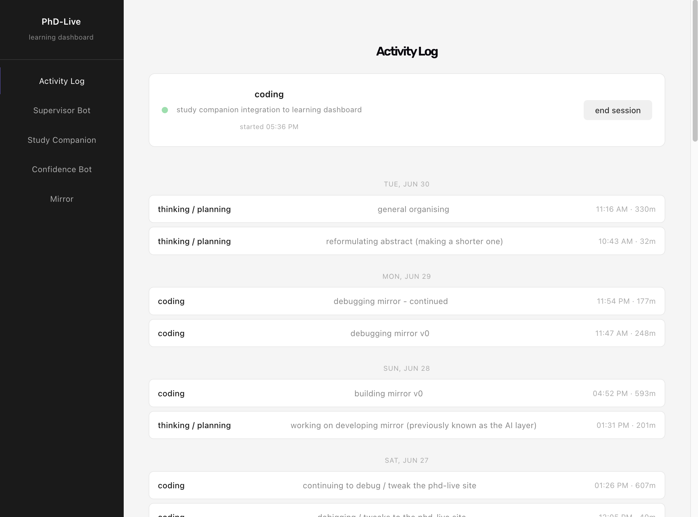
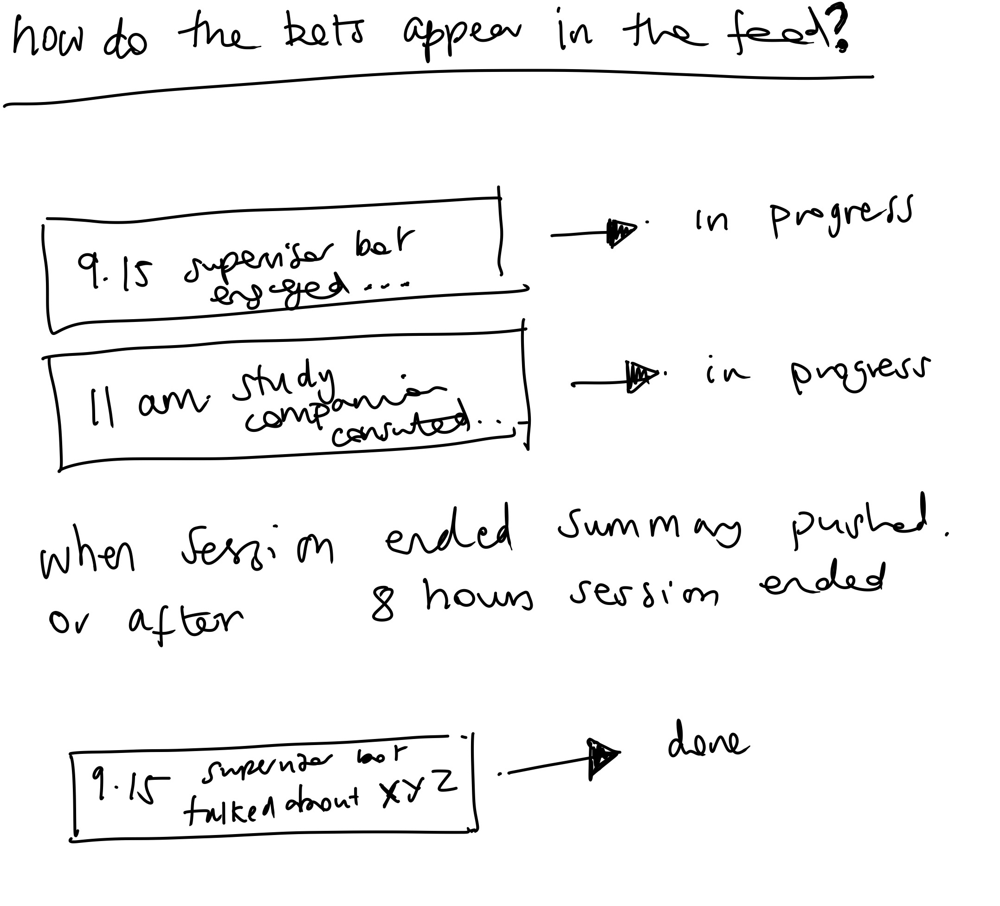

As this research has been developing, it's become clear that all these components could (and would) benefit from coming together in some kind of wider ecosystem. Where obsidian has kind of been a 'homebase' so far in terms of where the main work is happening - as I am building these various bots, it makes sense that this all has a base that connects.

Below are some initial sketches of how I imagine things coming together, this helped me spatialise it and better understand for myself how all these components come together

these sketches reference an earlier diagram I made sketching out the (high-level) architecture of the PhD-Live system. It's really important for me to work out what the 'AI layer' is exactly and how it fits into the wider picture.

this work has lead me to understand that this learning dashboard, is in fact not the 'homebase' but an interface that is part of the bigger over-arching '[[research-infrastructure]]'.

---
### Developing the Learning dashboard

the first behaviour I set up was the logging of activity -- I wanted there to be an easier way to capture a session that only in obsidian

Then I brought in the Mirror element as this is a vital part of the [[research-infrastructure]] (particularly on the [[project-phd-live-platform|phd-live platform]]) that was missing. 

now that I have this in place the next area of importance is to have the bots integrated.

But how I capture this is not immediately straightforward - what are the core aspects of an interaction with the bots that I want to capture and how do I build this. 

I decided the any time or duration is not so important as the already established session logging captures this to a certain degree, rather what is being discussed or worked through with the bots is the important thing.

** [[study-companion-bot|study companion]] / [[project-supervisor-bot|supervisor bot]] activity logging — decided**

Both bots log into the same `sessions` table the dashboard already uses (`source` field distinguishes them), but with a different lifecycle than manual ActivityLog entries.

A session is one calendar day's worth of activity with a given bot, not one sitting. The first message of a day creates the session and the entry appears immediately as `in progress`. Every subsequent message that day is a touchpoint — a timestamp appended to the same session, no new entry. Touchpoints are the unit of legibility: instead of duration (meaningless once a session can span gaps of hours), the entry shows a small timeline of when you returned to the bot that day.

The entry closes (`done`) either when the session is explicitly ended, or automatically after 8 hours with no new message, as a stopgap so nothing sits "in progress" indefinitely. On close, one summary is generated from the full conversation_history accumulated so far and becomes the entry's gist line. If a new touchpoint arrives after a stopgap-close, the same entry reopens (not a new entry) and goes back to `in progress`. Whenever it closes again, the summary is regenerated from the whole conversation to date — a single overwritten gist covering the full arc of the day, not a stacked per-chunk list. This was chosen over per-chunk summaries for legibility: a single line per entry reads consistently alongside the rest of the activity feed, where everything else (manual sessions, mirror entries) is also single-line.

Both bots use the same entry shape and the same state machine (in progress → done → possible reopen → in progress → done), rendered identically on the dashboard (private, end-of-day view with the touchpoint timeline) and on the PhD-Live live stream (public, where each touchpoint can appear as its own terse live-feed line as it happens, since that surface favors liveness over rolled-up completeness).

Explicitly out of scope for now: duration/time tracking, capability-gap flagging, and vault note linking — perhaps I will pick these up later.

**Study Companion - potential future direction (v2)**

Current model (v1): single rolling `conversation_history`, one daily session, all activity accumulated into one context.

Identified limitation: a single context flattens different threads of inquiry that may be unrelated. In practice, research work involves multiple concurrent strands (a chapter structure question, a methodology problem, a technical build issue) each potentially revisited across days, not just within one sitting.

V2 direction: multi-thread model, where each distinct inquiry has its own persistent `conversation_history`, keyed by thread id. The chat UI would allow creating, naming, and navigating between threads, closer to how multiple Claude conversation tabs actually get used. Session logging in the dashboard could track per-thread rather than per-day, so the activity feed reflects what was being worked through rather than just that the bot was used.

This is also the likely moment to introduce episodic memory (A-Mem) for Study Companion, already deferred to Mirror v1 — per-thread memory would make more sense than trying to apply it to one undifferentiated daily accumulation.

**Dependency:** thread management UI and a refactored `conversation_history` store in `server.py`. Not a small change -- treat as a separate build after v1 is stable and tested.